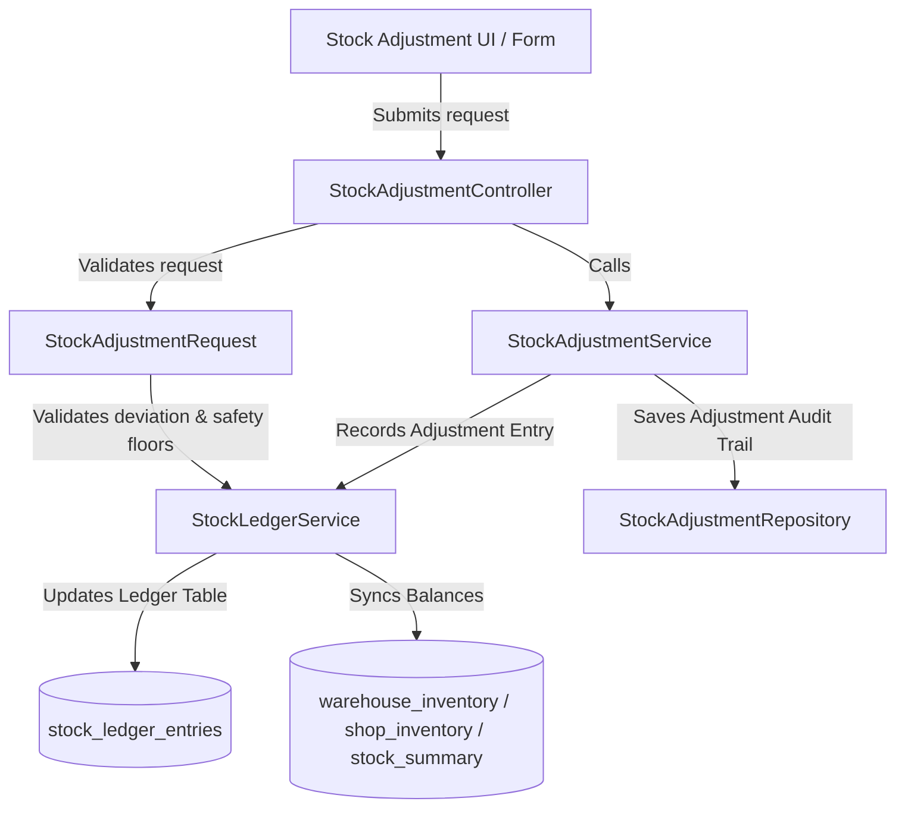

# Stock Adjustment Module: Architecture & Implementation Plan

This document outlines the proposed architectural approach, component boundaries, database schema, validation rules, and integration workflows for introducing the **Stock Adjustment** module.

---

## 1. Architectural Boundaries

To maintain clean separation of concerns, the module is divided into three distinct layers:



### A. Stock Ledger Boundary (`modules/StockLedger`)
* **Responsibility**: Financial and quantity audit trails.
* **Behavior**:
  * **Immutable Ledger**: Direct updates to quantities are strictly prohibited.
  * Adjustments are recorded as new ledger entries of type `ADJUSTMENT` with positive or negative quantities.
  * Synchronizes balance caches (`warehouse_inventory`, `shop_inventory`, and `stock_summary`) automatically when an adjustment is recorded.

### B. Stock Management Boundary (`modules/StockManagement` or `modules/StockAdjustment`)
* **Responsibility**: Business rules, reasons, and approvals.
* **Behavior**:
  * Records the business context (e.g. *Why* the adjustment happened: audit difference, damage, theft, moisture loss).
  * Validates safety floors and deviation thresholds.
  * Handles manager approvals if deviation limits are exceeded.

---

## 2. File Edits & Additions

### A. Database Migrations
1. **`create_stock_adjustments` migration**:
   Define schema for the `stock_adjustments` table to track business metadata:
   ```php
   Schema::create('stock_adjustments', function (Blueprint $table) {
       $table->id();
       $table->foreignId('location_id')->constrained('locations');
       $table->foreignId('product_id')->constrained('products');
       $table->string('batch_code');
       $table->string('grade')->nullable();
       $table->double('original_qty', 15, 2);
       $table->double('adjusted_qty', 15, 2); // The adjustment offset (e.g., -5.00 or +10.00)
       $table->double('new_qty', 15, 2);      // The resulting quantity after adjustment
       $table->string('reason');              // e.g., 'theft', 'damage', 'reconciliation'
       $table->string('status')->default('approved'); // 'approved', 'pending_approval'
       $table->foreignId('adjusted_by')->constrained('users');
       $table->foreignId('approved_by')->nullable()->constrained('users');
       $table->text('remarks')->nullable();
       $table->timestamps();
   });
   ```

### B. Backend Services & Repositories
1. **`StockAdjustment` Model**:
   * Stored under `modules/StockLedger/Models/` or a new `StockAdjustment/Models/` directory.
2. **`StockAdjustmentRepository`**:
   * Responsible for database operations involving the `stock_adjustments` audit log.
3. **`StockAdjustmentService`**:
   * Coordinates the transaction:
     * Saves the audit trail inside `stock_adjustments`.
     * If approved, triggers `StockLedgerService::recordEntry()` with transaction type `ADJUSTMENT`.
4. **`StockAdjustmentRequest` (Validation)**:
   * Form request to enforce adjustment business rules.

### C. UI & Controllers
1. **`StockAdjustmentController`**:
   * Renders the adjustment interface.
   * Handles AJAX requests to fetch real-time batch stocks.
   * Handles form submissions.
2. **Blade Views**:
   * Form layout with product selection, location selection, batch selection (reusing the existing batch search modal), original qty display, new qty/adjustment input, and reason select.

---

## 3. Core Validation & Business Rules

To protect data integrity, adjustments must pass two levels of validation:

### A. Safety Floor Check (Negative Adjustments)
* **Rule**: You cannot adjust a batch's stock below zero or below already-committed/sold amounts.
* **Calculation**:
  $$\text{Available Stock} = \text{Total Ledger Inflow} - \text{Total Ledger Outflow}$$
  If the adjustment amount is negative (e.g., subtracting $50\text{kg}$), the absolute adjustment quantity must not exceed the current available stock for that specific batch at the selected location:
  $$|\text{Adjustment Qty}| \le \text{Available Stock}$$

### B. Deviation Threshold (Approval Workflows)
* **Rule**: Adjustments exceeding a specific threshold (e.g., $>5\%$ of held quantity or $>100\text{kg}$) must go to a `pending_approval` state and require a manager/admin login to approve.
* **Flow**:
  * **Within Threshold**: Instantly recorded in the stock ledger.
  * **Exceeds Threshold**: Stored as `pending_approval` in `stock_adjustments` without writing to `stock_ledger_entries`. Once a manager clicks "Approve", the ledger entry is recorded and the balance caches are synced.

---

## 4. Integration with Stock Ledger

The `StockLedgerService::recordEntry` will receive adjustments using the following payload structure:

```php
$this->ledgerService->recordEntry([
    'transaction_type' => 'ADJUSTMENT',
    'location_id'      => $adjustment->location_id,
    'product_id'       => $adjustment->product_id,
    'batch_code'       => $adjustment->batch_code,
    'grade'            => $adjustment->grade,
    'quantity'         => $adjustment->adjusted_qty, // Can be positive or negative
    'unit'             => $unit,
    'unit_cost'        => $unitCost,
    'reference_id'     => $adjustment->id,
    'reference_type'   => get_class($adjustment),
    'remarks'          => $adjustment->reason . ': ' . $adjustment->remarks,
]);
```
This automatically updates `warehouse_inventory`, `shop_inventory`, and `stock_summary` using the existing cache synchronization listener.
