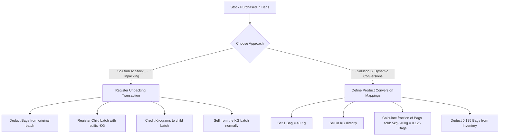

# Implementation Plan: Unit Conversion & Unpacking (Bags to Kilograms)

This document provides a detailed analysis, architectural proposal, and step-by-step implementation plan to handle unit conversions in the inventory system—such as purchasing in **Bags** and selling in **Kilograms (kg)**.

---

## 1. The Core Problem & Database Constraints

In the database, the available stock is tracked in the `warehouse_inventory` and `stock_summary` tables:
* **`warehouse_inventory`**: Tracks quantity (`qty`) and batch (`batch`), but does **not** store the unit of measurement.
* **`stock_summary`**: Tracks quantity (`current_qty`) and has a `unit` field.
* **`stock_purchase_items`**: Tracks the original purchased quantity, unit, and cost, enforcing a `unique` constraint on the `batch` column.
* **`warehouse_inventory.batch`**: Has a foreign key referencing `stock_purchase_items.batch`.

### Why Mixing Units in Sales Fails:
If a user purchases **100 Bags** of shallots:
1. `warehouse_inventory` stores a row with `qty = 100.00`.
2. If the user tries to sell **5 kg** directly without conversion, the system records a sale of `-5.00` in the ledger and decrements `warehouse_inventory` by `5`.
3. This incorrectly leaves **95 Bags** in stock, meaning the system deducted **5 Bags** instead of **5 kg** (a massive stock discrepancy).

To prevent this, the stock must be explicitly or implicitly converted. 

---

## 2. Proposed Architectural Solutions



### Solution A: Physical "Unpacking" (Stock Conversion Transaction) — *RECOMMENDED*
The user performs a physical unpacking action in the warehouse (e.g. opening 5 bags and weighing them) and records it in the application.

* **How it works**:
  1. The user goes to a **Stock Unpacking / Conversion** screen.
  2. They choose the source batch (e.g. `Batch-A`, unit: `Bags`, available: `100`).
  3. They specify the quantity to unpack (e.g. `5` Bags).
  4. They specify the target unit (`kg`) and the actual yield obtained (e.g. `200` kg).
  5. The system performs a database transaction:
     - Deducts `5` Bags from the parent batch.
     - Inserts a child batch (e.g. `Batch-A-KG`) in `stock_purchase_items` (to satisfy foreign keys) with unit `kg`.
     - Calculates the new unit cost: $\text{Unit Cost per kg} = \frac{5 \times \text{Cost per Bag}}{200}$.
     - Credits `200` kg to the child batch.
  6. The user sells from `Batch-A-KG` in kilograms. The deduction works perfectly (e.g. selling 5 kg leaves 195 kg).

* **Why it is recommended**:
  - **Handles shrinkage and waste**: Real-world agricultural products vary. 5 bags of shallots rarely yield exactly 200 kg due to moisture loss, rot, or dirt. This transaction captures the *actual yield*.
  - **Audit Trail**: Keeps a clear ledger record showing exactly when and why stock transitioned from Bags to Kilograms.
  - **Zero impact on Sales/Transfer code**: Sales and transfers work out-of-the-box because they interact with a normal `kg` batch.

### Solution B: Implicit / Dynamic Unit Conversions
The system automatically translates sold kilograms back into bag fractions at transaction time based on pre-defined ratios.

* **How it works**:
  1. Define a product-level conversion mapping (e.g. `1 Bag = 40 kg` for Shallots).
  2. When selling `5 kg`, the system computes $\frac{5}{40} = 0.125$ Bags.
  3. Deducts `0.125` Bags from the database.
* **Why it is NOT recommended**:
  - Leads to fractional bags in inventory (e.g. `99.875` Bags left), which is physically impossible to count.
  - Does not account for waste or moisture loss.
  - Requires updating all sale and transfer services to check and apply conversions dynamically.

---

## 3. Step-by-Step Implementation Guide (Solution A)

Here is the exact roadmap of code modifications across all modules.

### Step 1: Database Migration (StockManagement Module)
Create a migration to track stock conversions:

```php
use Illuminate\Database\Migrations\Migration;
use Illuminate\Database\Schema\Blueprint;
use Illuminate\Support\Facades\Schema;

return new class extends Migration {
    public function up(): void
    {
        Schema::create('stock_conversions', function (Blueprint $table) {
            $table->id();
            $table->string('reference_no')->unique(); // e.g. CONV-2026-00001
            $table->unsignedBigInteger('location_id'); // Warehouse/Shop ID
            $table->unsignedBigInteger('product_id');
            
            // Source details
            $table->string('source_batch_code');
            $table->decimal('source_qty_deducted', 12, 2);
            $table->string('source_unit');
            
            // Destination details
            $table->string('dest_batch_code');
            $table->decimal('dest_qty_created', 12, 2);
            $table->string('dest_unit');
            
            $table->unsignedBigInteger('created_by');
            $table->text('remarks')->nullable();
            $table->timestamp('conversion_date');
            $table->timestamps();

            $table->foreign('location_id')->references('id')->on('locations');
            $table->foreign('product_id')->references('id')->on('products');
            $table->foreign('created_by')->references('id')->on('users');
        });
    }

    public function down(): void
    {
        Schema::dropIfExists('stock_conversions');
    }
};
```

### Step 2: Create the Stock Conversion Models
Create `StockConversion.php` inside `modules/StockManagement/Models/`:

```php
namespace Modules\StockManagement\Models;

use Illuminate\Database\Eloquent\Model;
use Modules\Inventory\Models\Products;
use Modules\Locations\Models\LocationModel as Location;

class StockConversion extends Model
{
    protected $fillable = [
        'reference_no',
        'location_id',
        'product_id',
        'source_batch_code',
        'source_qty_deducted',
        'source_unit',
        'dest_batch_code',
        'dest_qty_created',
        'dest_unit',
        'created_by',
        'remarks',
        'conversion_date',
    ];

    public function product()
    {
        return $this->belongsTo(Products::class);
    }

    public function location()
    {
        return $this->belongsTo(Location::class, 'location_id');
    }
}
```

### Step 3: Implement the Stock Conversion Service
Create `StockConversionService.php` inside `modules/StockManagement/Services/`:

```php
namespace Modules\StockManagement\Services;

use Illuminate\Support\Facades\DB;
use Modules\StockLedger\Services\StockLedgerService;
use Modules\StockManagement\Models\StockIn\StockPurchaseItem;
use Modules\StockManagement\Models\StockConversion;
use Exception;

class StockConversionService
{
    public function __construct(protected StockLedgerService $ledgerService) {}

    /**
     * Executes the stock unpacking and conversion transaction.
     */
    public function convertStock(array $data): void
    {
        DB::transaction(function () use ($data) {
            $locationId = (int)$data['location_id'];
            $productId = (int)$data['product_id'];
            $sourceBatch = $data['source_batch_code'];
            $qtyToUnpack = (float)$data['source_qty_deducted'];
            $yieldQty = (float)$data['dest_qty_created'];
            $targetUnit = $data['dest_unit'];

            // 1. Lock and verify source stock availability
            $available = $this->ledgerService->getAvailableStock($locationId, $productId, $sourceBatch, null);
            if ($available < $qtyToUnpack) {
                throw new Exception("Insufficient stock to perform conversion. Available: {$available}");
            }

            // 2. Fetch original purchase item for cost calculations
            $sourcePurchaseItem = StockPurchaseItem::where('batch', $sourceBatch)->firstOrFail();
            $sourceUnitCost = (float)$sourcePurchaseItem->unit_cost;
            $totalCostUnpacked = $qtyToUnpack * $sourceUnitCost;
            $newUnitCost = $totalCostUnpacked / $yieldQty;

            // 3. Register child batch in stock_purchase_items to satisfy foreign keys
            $childBatch = $sourceBatch . "-KG"; // Or dynamically generated unique batch code
            
            StockPurchaseItem::firstOrCreate(
                ['batch' => $childBatch],
                [
                    'stock_in_purchase_id' => $sourcePurchaseItem->stock_in_purchase_id,
                    'location_id'          => $locationId,
                    'product'              => $productId,
                    'grade'                => $sourcePurchaseItem->grade,
                    'quantity'             => $yieldQty,
                    'unit'                 => $targetUnit,
                    'unit_cost'            => $newUnitCost,
                    'total'                => $totalCostUnpacked,
                    'remarks'              => "Unpacked from {$sourceBatch}",
                ]
            );

            // 4. Record Ledger Entries
            
            // Deduct from Source Batch (e.g. -5 Bags)
            $this->ledgerService->recordEntry([
                'transaction_type' => 'UNPACK_OUT',
                'location_id'      => $locationId,
                'product_id'       => $productId,
                'batch_code'       => $sourceBatch,
                'grade'            => $sourcePurchaseItem->grade,
                'quantity'         => -$qtyToUnpack,
                'unit'             => $sourcePurchaseItem->unit,
                'unit_cost'        => $sourceUnitCost,
                'remarks'          => "Unpacked into batch {$childBatch}",
            ]);

            // Add to Destination Batch (e.g. +200 Kg)
            $this->ledgerService->recordEntry([
                'transaction_type' => 'UNPACK_IN',
                'location_id'      => $locationId,
                'product_id'       => $productId,
                'batch_code'       => $childBatch,
                'grade'            => $sourcePurchaseItem->grade,
                'quantity'         => $yieldQty,
                'unit'             => $targetUnit,
                'unit_cost'        => $newUnitCost,
                'remarks'          => "Unpacked from batch {$sourceBatch}",
            ]);

            // 5. Log the Conversion History
            StockConversion::create([
                'reference_no'        => $this->generateReferenceNo(),
                'location_id'         => $locationId,
                'product_id'          => $productId,
                'source_batch_code'   => $sourceBatch,
                'source_qty_deducted' => $qtyToUnpack,
                'source_unit'         => $sourcePurchaseItem->unit,
                'dest_batch_code'     => $childBatch,
                'dest_qty_created'    => $yieldQty,
                'dest_unit'           => $targetUnit,
                'created_by'          => auth()->id() ?? 1,
                'conversion_date'     => now(),
                'remarks'             => $data['remarks'] ?? null,
            ]);
        });
    }

    protected function generateReferenceNo(): string
    {
        $latest = StockConversion::orderBy('id', 'desc')->first();
        $num = $latest ? ((int)substr($latest->reference_no, 5)) + 1 : 1;
        return 'CONV-' . str_pad((string)$num, 5, '0', STR_PAD_LEFT);
    }
}
```

### Step 4: Registering Transaction Types (StockLedger Module)
Ensure transaction types `UNPACK_OUT` and `UNPACK_IN` are allowed. In `StockLedgerService`, the existing sync methods handle negative and positive quantities perfectly. 

We only need to update the placeholder helper `hasMovements` to include them:
```php
        $ledgerMovementsExist = StockLedgerEntry::where([
            'location_id' => $locationId,
            'product_id'  => $productId,
            'batch_code'  => $batchCode,
        ])
        ->when($grade, function($q) use ($gradeOptions) {
            $q->whereIn('grade', $gradeOptions);
        })
        ->whereNotIn('transaction_type', ['PURCHASE', 'ADJUSTMENT', 'VOID', 'UNPACK_IN', 'UNPACK_OUT'])
        ->exists();
```

---

## 4. Summary of Impact Across Modules

| Module | Files Affected | Changes / Actions Required |
| :--- | :--- | :--- |
| **Inventory** | None (Schema holds) | No schema changes are needed. Ensure `Bags` and `kg` exist in the `units` table. |
| **StockManagement** | `Database/Migrations`, `Models/`, `Services/` | 1. Add `stock_conversions` migration.<br>2. Add `StockConversion` model.<br>3. Add `StockConversionService` to orchestrate deductions/additions and write child batches. |
| **StockLedger** | `StockLedgerService` | 1. Ensure `UNPACK_IN` and `UNPACK_OUT` transaction types are supported.<br>2. Ledger writes automatically keep cache tables (`warehouse_inventory` and `stock_summary`) synced. |
| **Warehouse / Shop** | `WarehouseSaleRepository` | No changes. Sales will query and deduct from the newly created child batches (e.g. suffix `-KG`) using standard procedures. |
